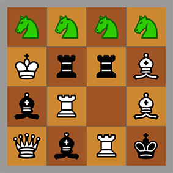
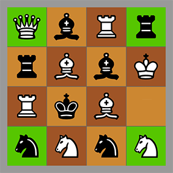

# React-Chess

## What is it?

A couple of single-player chess minigames, programmed as a web app in React.js.

## Where can I play it?

Right here: https://mn113.github.com/react-chess/dist/

## How does the game work?

The rules are displayed on the page linked above.

## I want to know more...

I didn't invent these games. Here are some links to ChessVariants.com: [Hippodrome](http://www.chessvariants.com/solitaire.dir/hippodrome.html), [Queen's Quadrille](http://www.chessvariants.com/solitaire.dir/quadrille.html).

There are many more which could be of interest to puzzlers or programmers.

## This damn game is unwinnable!

Since the boards are randomised, a small number of games may pose this problem. The totally unwinnable ones are weeded out at the start. Of the rest, a majority are winnable.

## Okay, how about the code?

A hierarchical component structure in React, namely App > Board > Square > Piece. It is not too complex. The 4x4 board is rendered using CSS Grid and a spritesheet.

## Contributors

This code is for learning - primarily the author's. You may submit PRs if you see something to improve, but they are not actively sought or expected.

## Licence

The code for this project is forkable under the MIT licence.
